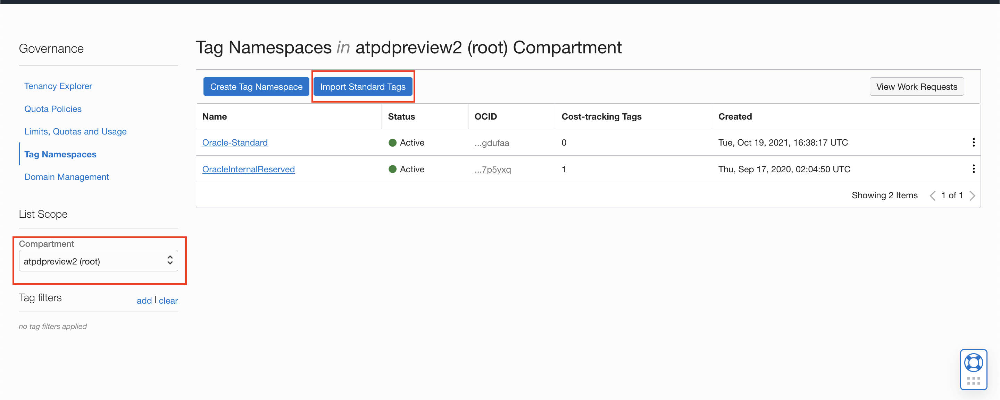

# Oracle Standard Tags

## Introduction
Oracle Cloud Infrastructure Tagging allows you to add metadata to resources, defining keys and values and associating them with resources. You can use the tags to organize and list resources based on your business needs.

To enable customers to manage OCI resources securely and cost-effectively, Oracle provides a set of pre-defined tags in line with best practices for tagging resources. These tags are grouped into two namespaces - The OracleStandard namespace and the OracleApplicationName namespace.

This lab walks you through the steps to import Oracle Standard Tags into your tenancy, create and edit tag key definitions, and use the standard tags with your Autonomous Database.

Estimated Time: 20 minutes

### Objectives

As OCI Governance administrator and DB users:
1. To enforce tagging best practices
2. To seamlessly apply Tags to OCI resources

### Required Artifacts

- An Oracle Cloud Infrastructure account.
- Permission for users to use Tags. Refer to [this documentation](https://docs.oracle.com/en-us/iaas/Content/Tagging/Tasks/managingtagsandtagnamespaces.htm#Who) to allow users to work with Tags.
- Have access to **Root Compartment** to import Oracle Standard Tags to the Tenancy.

## Task 1: Import Oracle Standard Tags to your Tenancy

- Log in to OCI console and navigate to **Governance & Administration** and click **Tag Namespaces**

**NOTE**: Import Standard Tags is only available from **root compartment**. 

- Select **root compartment** from **Compartment** dropdown, and click **Import Standard Tags**. 

- **Import Standard Tags** page provides a set of Tag Keys for consistent governance across your tenancy. Tag namespace will be created at the root compartment. 

**NOTE**: The list of namespaces are continuously updated by OCI service teams. All new and modified Tags will be listed in Import Standard Tags page. 

Here you see the Tag Key Definition for Oracle-Standard Namespace, similarly you can click on OracleApplicationName Namespaces to view Tag Key Definitions. 

- Select **Oracle-Standard** Tag Namespace and click **Import**

- On sucessful import, you should see **Oracle-Standard** Tag Namespace listed under **root** compartment.

## Task 2: Create or Edit Tag Key Definition

OCI Governance Administrators can add additional **Values** to an existing Tag Key Definition or Create a new Tag Key Definition. 

- Click **Governance & Administration** and navigate to **Tag Namespaces**. 

- Click **Oracle-Standard** Tag Namespace that you created in **Task 1**.

- **Oracle-Standard** Tag Namespace Details page lists all the existing **Tag Key Definitions**. 

- Click **Create Tag Key Definition** to create a new Tag Key definition in selected Tag Namespace.

- Enter Tag Key, Description and Values and click **Create Tag Key Definition**.

- You have succesfully created a new **Tag Key Definition** for **Oracle-Standard** Namespace!

- To add or remove values from an existing **Tag Key Definition**, select your **Tag Key Definition**.

- Click **Edit Tag Key Definition**

- Add or remove **Tag Value** and click Save.

## Task 3: Use Standard Tags with Autonomous database

Tags can be added either at the time of creation of resource or navigting to an existing resource and adding it. 

- Click Menu and navigate to Autonomous Database. 

- Click Create Autonomous Database, and enter all the required fields. 

You can learn how to create Autonomous Database in **Provisioning an Autonomous Transaction Processing Database Instance** under **Oracle Autonomous Database Dedicated for Developers and Database Users** Lab. 

- Scroll down to the bottom of Create Autonomous Database page, and click **Show Advanced Options**. 

- Select Tags and select **Oracle-Standard** under **Tag Namespace** and select the appropriate Tag key and click **Create Autonomous Database**. 

- You can also add Tags to an existing Autonomous database. Select the ADB that you would like to add the Tags and click Tags. 

- Click **Add tags** and select **Oracle-Standard** under Tag Namespace and select the appropriate **Tag Key** and **Tag Value** and click **Apply**.

Click [this documentation](https://docs.oracle.com/en/cloud/paas/autonomous-database/myyyc/index.html) to learn more about Tagging.

## Acknowledgements

- **Author** - Tejus S.
- **Adapted by** -  Rick Green
- **Last Updated By/Date** - Tejus S., April 2022

## See an issue or have feedback?  
Please submit feedback [here](https://apexapps.oracle.com/pls/apex/f?p=133:1:::::P1_FEEDBACK:1).   Select 'Autonomous DB on Dedicated Exadata' as workshop name, include Lab name and issue / feedback details. Thank you!
