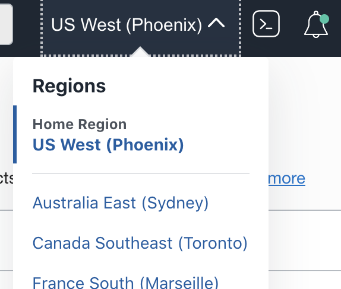
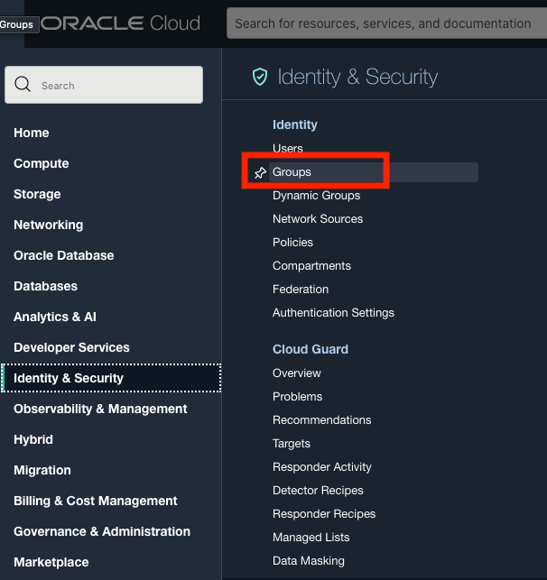
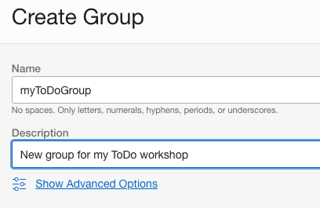
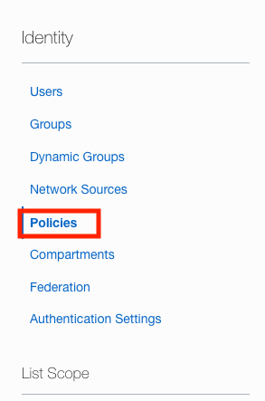
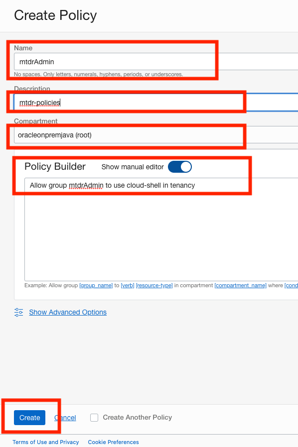
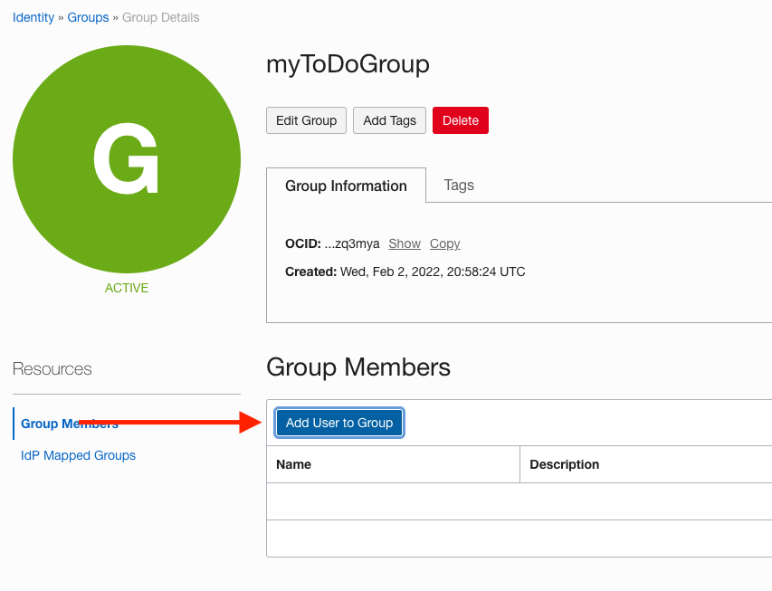
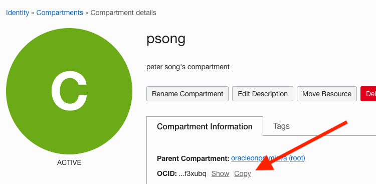
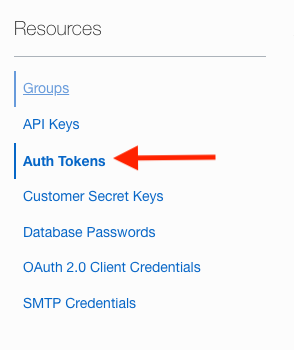

# Setup the development environment

## Introduction

In this lab, you will configure your development environment and collect information that will be used later throughout this workshop. The setup script requires certain environment variables to be set, which is the reason for the configuration script (setup.sh). After the environment variables are set, the setup script uses Terraform, Bash, and SQL to automate the creation of all the resources needed for this lab, such as VCN's, an OKE Cluster, API Gateway, Autonomous database, etc. The script also creates a table and inserts one row, which we will use to make sure the setup was done correctly.

Estimated time: 25 minutes

### Objectives

* Create group and give the appropriate permissions to run the setup
* Clone the github repository and execute the setup script to create the following resources:
    * 1 Autonomous database
    * 1 API gateway
    * 1 Object Storage bucket
    * 1 OKE cluster
    * 1 OCI Registry
    * 1 Virtual Cloud Network

Watch this video for a quick walkthrough of this lab

Mac:
[](youtube:Zo7r8Ahdhsc)
### Prerequisites

* This lab requires an [Oracle Cloud account](https://www.oracle.com/cloud/free/). You may use your own cloud account, a cloud account that you obtained through a trial, a Free Tier account, or a LiveLabs account.

## **Task 1**: Create Group and Appropriate Policies
[Policies](https://docs.oracle.com/en-us/iaas/Content/Identity/Concepts/policies.htm) determine what resources users are allowed to access and what level of access they have. You can create a group and add as many users as you like to that group. 

If you are not the tenancy administrator, there may be additional policies you must have in your group to perform some of the steps for this lab. If you cannot create a group and add specific policies, please ask your tenancy administrator for the correct policies in order to follow along.

**If your group already has the permissions listed in part 6 of this task you may skip to Task 2.**

1. First make sure you are in your home region.

	


2. Click the navigation menu in the top left, click on identity and security and select Groups.

	


3. Click on Create Group

	


4. Enter the details for group name and description. Be mindful of the restrictions for group name (no spaces, etc.)

	

  Once you have filled in these details click create. Your group should show up under Groups

	  


5. Navigate to policies and click Create Policy

	

	
6. You should see a page like this. This is where you will create the policy that will give the group permissions to execute the setup for this workshop. (note: replace oracleonpremjava(root) with the root of your tenancy)

	
Select **Show manual editor** and copy and paste these policies in the box below
	```
	<copy>
	Allow group myToDoGroup to use cloud-shell in tenancy
	Allow group myToDoGroup to manage users in tenancy
	Allow group myToDoGroup to manage all-resources in tenancy
	Allow group myToDoGroup to manage buckets in tenancy
	Allow group myToDoGroup to manage objects in tenancy
	</copy>
	```
7. Add your user to the group that you have just created by selecting the name of the group you have created and selecting add user to group

	

## **Task 2**: Launch the Cloud Shell


1. Launch Cloud Shell

  The Cloud Shell is a small virtual machine running a Bash shell which you access through the OCI Console. It comes with a pre-authenticated CLI pre-installed and configured so you can immediately start working in your tenancy without having to spend time on installation and configuration!

  Click the Cloud Shell icon in the top-right corner of the Console.


  

## **Task 3**: Create a Folder for the Workshop Code

1. Create a directory, which will be used to create a compartment of the same name in your tenancy if you do not provide one of your own. The directory name **must be between 1 and 13 characters, contain only letters or numbers, and start with a letter**. Make sure that a compartment of the same name does not already exist in your tenancy or the setup will fail. 

	````
	<copy>
	mkdir reacttodo
	</copy>
	````
	````
	<copy>
	cd reacttodo
	</copy>
	````

## **Task 4**: Clone the Workshop Code

1. Clone the workshop code into the directory you've just created.
	````
	<copy>
	git clone -b springboot --single-branch https://github.com/oracle/oci-react-samples.git
	</copy>
	````
  You should now see `oci-react-springboot-simple` in your root directory

## **Task 5**: Start the Setup

The setup script uses Terraform, Bash scripts, and SQL to automate the creation of the resources needed for this lab. The script will ask for the necessary components to automate resource creation. 


1. Change to the MtdrSpring directory:

	```
	<copy>
	cd oci-react-samples/MtdrSpring
	</copy>
	```
2. Copy this command to make sure that env.sh gets run everytime you start up cloud shell

	```
	<copy>
	echo source $(pwd)/env.sh >> ~/.bashrc
	</copy>
	```
3. Run the following sequence of commands to start the setup
	```
	<copy>
	source env.sh
	source setup.sh
	</copy>
	```
4. If the previous steps were done correctly, the setup will ask for your OCID. 

  

  To find your user's OCID navigate to the upper right within the OCI console and click on your username.


	


  Copy your user's OCID by clicking copy

  	

5. The setup will then ask for your compartment OCID. If you have a compartment, enter the compartment's OCID. If you do not have a compartment then hit enter and it will create a compartment under the root compartment for you automatically. 

  	

  To use an existing compartment, you must enter the OCID of the compartment yourself. To find the OCID of an existing compartment, click on the Navigation Menu of the cloud console, navigate to **Identity & Security** and click on **Compartments**

  	
  Click the appropriate compartment and copy the OCID 

  	


6. In the next step, the setup will create an authentication token for your tenancy so that docker can log in to the Oracle Cloud Infrastructure Registry. If there is no room for a new Auth Token, the setup will ask you to remove an Auth Token then hit enter when you are ready.

  

  Select Auth Tokens under resources

  

  Delete one Auth Token if you have too many

  

7. The setup will ask you to enter the admin password for the database. Database passwords must be 12 to 30 characters and contain at least one uppercase leter, one lowercase leter, and one number. The password cannot contain the double quote (") character or the word "admin".

	
    

## **Task 6**: Monitor the Setup
The setup should take around 20 minutes to complete. During the setup, the cloud shell will output its progress so keep an eye on it to see exactly what it's doing. If there are any errors, you should check the logs located in the $MTDRWORKSHOP_LOG directory.

1. The setup will update you with the progress of the resource creation. Wait for the setup to complete to move on to the next lab

	

You can also monitor the setup using the following command:
		```
		<copy>
		ps -ef
		</copy>
		```
## **Task 7**: Complete the Setup

When the setup is done running, you will see a message: **SETUP VERIFIED**

You can view the log files in the $MTDRWORKSHOP_LOG directory. The command below will show you all the log files. You can view the contents of the files if you'd like.
	```
	<copy>
	ls -al $MTDRWORKSHOP_LOG
	</copy>
	```

You may now **proceed to the next lab**.

## Acknowledgements

* **Authors** -  - Kuassi Mensah, Dir. Product Management, Java Database Access; Peter Song, Developer Advocate JDBC
* **Contributors** - Jean de Lavarene, Sr. Director of Development JDBC/UCP
* **Last Updated By/Date** - Peter Song, Developer Advocate,  Feb 2022
