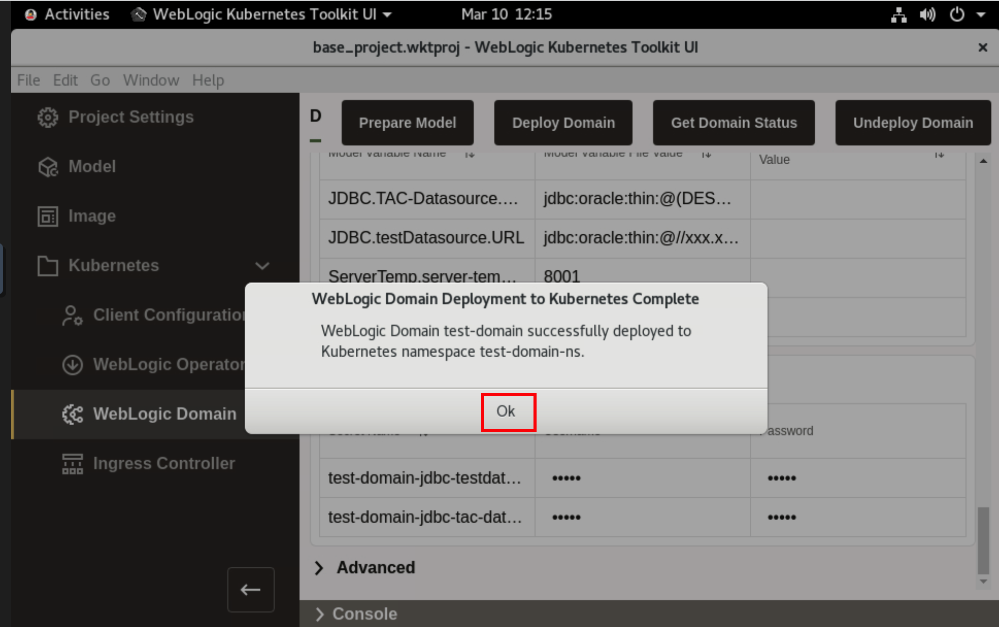

# Deployment of WebLogic Domain to the Oracle Container Engine for Kubernetes (OKE) on Oracle Cloud Infrastructure (OCI) From WebLogic Kubernetes Toolkit UI

## Introduction

In this lab, we deploy the WebLogic Domain to kubernetes cluster. In primary image section, we specify the oracle account credential. In auxiliary image section, we specify oracle cloud account credential. Here we also specify the replica for the cluster.

### Objectives

In this lab, you will:

* Deploy the WebLogic Domain to the Oracle Container Engine for Kubernetes (OKE) on Oracle Cloud Infrastructure (OCI).

### Prerequisites

* You must have an [Oracle Cloud Infrastructure](https://cloud.oracle.com/en_US/cloud-infrastructure) enabled account.
* You must have Oracle Cloud Account. You must have information about your tenancy name and cloud account credentials.
* Successfully created the virtual machine, which consist of all required softwares.
* You should have a text editor, where you can paste the commands and URLs and modify them, as per your environment. Then you can copy and paste the modified commands for running them in the terminal.

## Task 1: Deploy the WebLogic Domain to the Oracle Container Engine for Kubernetes (OKE) on Oracle Cloud Infrastructure (OCI)

The WebLogic Domain section provides support for creating and deploying the Kubernetes custom resource for the WebLogic domain as defined by the WebLogic Kubernetes Operator.

1. Click *WebLogic Domain*. we used weblogic/welcome1 as *WebLogic Admin Username*/*WebLogic Admin Password*. If you want, you can change these values.
    


2. Scroll down, enter the following in Primary Image section, Enter *domain-secret* as *Image Pull Secret Name*, and Use Oracle account username and password in *Image Registry Pull Username* and *Image Registry Pull Password*. Enter your Oracle email id in *Image Registry Pull Email Address*. These are the same credential which you used to accept license for *weblogic* images in Oracle Container Registry.
    

3. Scroll down, enter the following in Auxiliary Image section, Enter *model-secret* as *Image Pull Secret Name*, and Use Cloud account username and password in *Image Registry Pull Username* and *Image Registry Pull Password*. Enter your Cloud email id in *Image Registry Pull Email Address*. These are the same credential which you used to push Auxiliary images in Oracle Cloud Container Image Registry.
    

4.  In *Clusters* section, click on *Edit* icon as shown.
    

5. Enter *2* as *Replicas* and then Click *OK*. The size of replica decides the number of managed server in the *Running* state after successfull deployment of WebLogic Domain to Kubernetes cluster.
    

6. In Datasources section, double click to edit *passwords* for two datasource. You can give *tiger* as password in both the datasources. Once done, click *Deploy Domain*.
    

7. Once you see *WebLogic Domain Deployment to Kubernetes Complete* window, Click *OK*.
    

8. Go back to terminal, Click *Activities* and select the *Terminal* window. Copy the following command and paste it terminal. You should see the similar output, where pod for introspector run first then for the Admin Server and later pods for managed server goes in the *Running* state.

    ````bash
    <copy>kubectl get pods -n test-domain-ns -w</copy>
    ````

    

9. You can also get the domain status through *WebLogic Kubernetes Toolkit UI*. Go back to *WebLogic Kubernetes Toolkit UI* and click *Get Domain Status*.
    

10. In Domain Status window, Scroll down to see status of all server pods then click *OK*.
    


## Acknowledgements

* **Author** -  Ankit Pandey
* **Contributors** - Maciej Gruszka, Sid Joshi
* **Last Updated By/Date** - Kamryn Vinson, March 2022