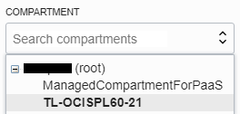
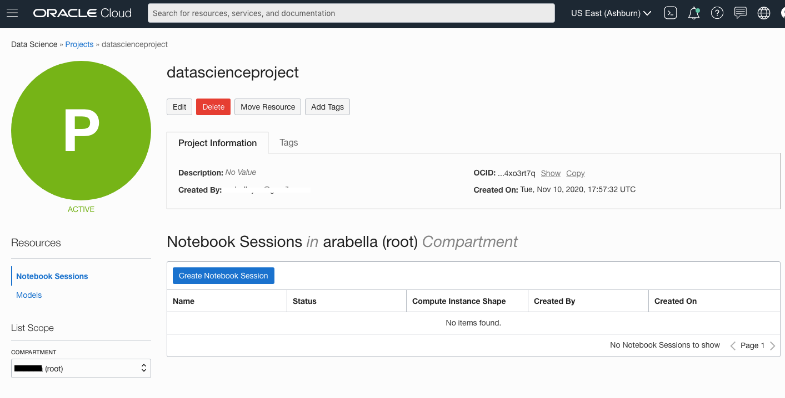

# Data Science Project Setup

## Introduction

Projects are used to collect related data science resources and artifacts, such that it enables you to organize your work. They contain a collection of notebook sessions and models.

*Estimated Time*: 5 minutes

### Objective

In this lab, you:
* Use the Console to create a Data Science Project.

### Prerequisites

* A tenancy that is configured to work with the Data Science service.
* An account that has permission to create a Data Science project.

## Task 1: Creating a Project

You create a Data Science project to organize your notebook sessions and models within your project.

1. [Login to the OCI Console](https://www.oracle.com/cloud/sign-in.html).
1. Open the navigation menu.
1. Under **Data and AI** and select **Data Sciences**. This will open the **Projects** page.
1. Select the compartment where the project is to be created.

    

1. Click **Create Project**.

    
1. (Optional, but recommended) Enter a unique name (255 character limit) for the project. If you do not provide a name, a name is automatically generated for you.

1. (Optional, but recommended) Enter a description (400 character limit) for the project. If you do not add a description, it remains empty.

1. (Optional) Add tags to easily locate and track the project by selecting a tag namespace, then entering the key and value. To add more than one tag, click **+Additional Tags**. [Tagging](https://docs.cloud.oracle.com/iaas/Content/Tagging/Concepts/taggingoverview.htm) describes the various tags that you can use organize and find projects including [cost-tracking tags](https://docs.cloud.oracle.com/iaas/Content/Tagging/Tasks/usingcosttrackingtags.htm).

1. (Optional) To view the details for your project immediately after creation, select **VIEW DETAIL PAGE ON CLICKING CREATE.**.

    

1. Click **Create**.

    

    This creates the project and opens the project page.

You may now **proceed to the next lab**.

## Acknowledgements

* **Author**: [John Peach](https://www.linkedin.com/in/jpeach/), Principal Data Scientist
* **Last Updated By/Date**:
    * [John Peach](https://www.linkedin.com/in/jpeach/), Principal Data Scientist, April 2022
