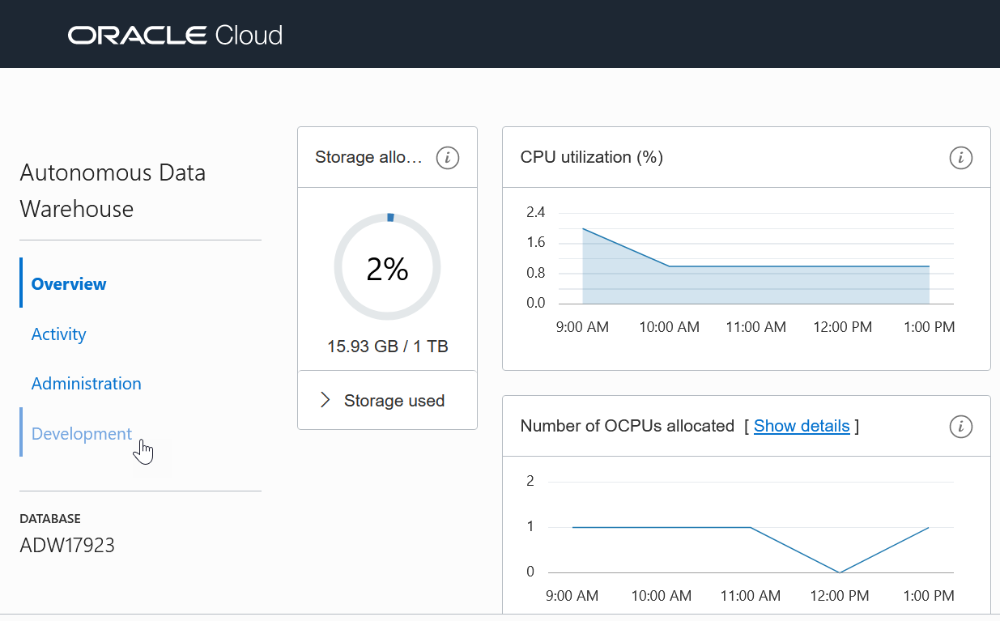

# How can I create a new Machine Learning Notebook in Oracle Autonomous Database?

Duration: 4 minutes

## Create a new Machine Learning Notebook in Oracle Autonomous Database

1. If you have your ADB ML user sign in URL bookmarked, navigate to the link and enter the username and password you provided when you created your machine learning user and click on **Sign in**. This will launch the Database Actions Launchpad page.

    

    

    
If you do not have your ADB ML user sign in URL bookmarked, click expand to view the steps to sign in as machine learning user!

    1. If you do not have your ADB ML user sign in URL bookmarked, then click the navigation menu in the upper left of the Oracle Cloud Console, navigate to **Oracle Database**, select **Autonomous Database** and navigate to your ADB instance.

    2. From the compartment drop-down menu, select the **Compartment** where your Oracle Autonomous Database resource is provisioned. If there were a long list of databases, you could filter the list by the **State** of the databases, and sort by **Workload Type**.

    3. From the databases displayed, click **Display Name** of the database you wish to create a notebook for the machine learning user and click **Service Console**. The Launch Service Console dialog opens. Wait till the Service Console opens.

	    

    4. On the Service Console page, click **Development** on the left pane.

	    

    5. Click **Oracle Machine Learning User Interface.** This opens the Oracle Machine Learning sign in page.

        

    6. Enter the username and password you provided when you created your machine learning user and click on **Sign in**. This will launch the Oracle Machine Learning home page.

        

    

2.  Click on the upper-left navigation menu and select **Notebooks**.

    

3.  We will create a notebook from the beginning, select **Create**.

    

4.  Provide the following details:
    - **Name:** In the Name field, enter **Test Notebook**.
    - **Comments:** In the **Comments** field, enter comments, if any.
    - **Connections:** In the **Connections** field, select a connection in the drop-down list. By default, the **Global** Connection Group is assigned.

5. Click **OK**. Your notebook is created and it opens in the notebook editor.

    

6. Now you can view the notebook is created.

    

    You can now use the notebook to create a Markdown paragraph, SQL paragraph, PL/SQL paragraph and Python paragraph.

## Learn More

* [Oracle Machine Learning UI](https://docs.oracle.com/en/database/oracle/machine-learning/oml-notebooks/)
* [Interactive Tour - Oracle Machine Learning UI](https://docs.oracle.com/en/cloud/paas/autonomous-database/oml-tour/)