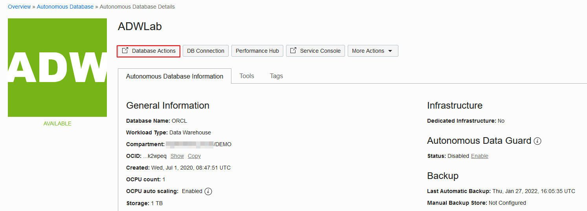
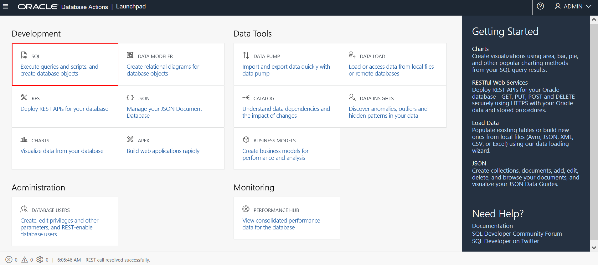
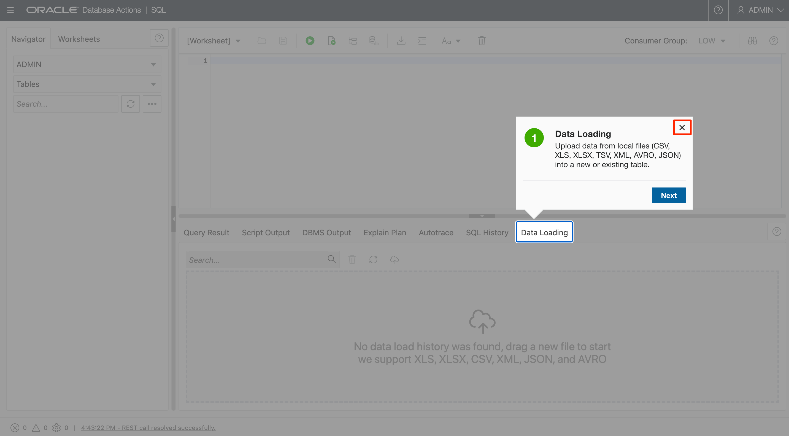

# How can I grant privileges to my new Machine Learning user to access ADB Data Tools?

Duration: 4 minutes

## Grant privileges to your new Machine Learning user to access ADB Data Tools

1.  Click the navigation menu in the upper left, navigate to **Oracle Database**, select **Autonomous Database** and navigate to your ADB instance.

2. From the compartment drop-down menu, select the **Compartment** where your Oracle Autonomous Database resource is provisioned. If there were a long list of databases, you could filter the list by the **State** of the databases, and sort by **Workload Type**.

3. From the databases displayed, click **Display Name** of the database where your new machine learning user is created and click **Database Actions** on the Autonomous Database Details page.

    

4. A **Launch DB Actions** screen appears. Click **Close** on the dialog box.

	

5. The Database Actions login page opens in a new tab, log in with your ADB admin user credentials, provide the **Username - ADMIN** and click **Next**. Then give the **Password** you provided when you created your the Autonomous database instance and click **Sign in**.

    

    

6. From the Database Actions Development menu, select **SQL**.

    

7. If this is the first time you are logging in to the SQL Developer Web, dismiss the Help by clicking on the **X** in the popup.

    

8. By default, only the ADMIN user can use the SQL Developer Web. To enable your machine learning user to use it, copy and paste the below procedure. Replace `<provide your machine learning username>` with your machine learning username.

    ```
    <copy>
    BEGIN
      ORDS_ADMIN.ENABLE_SCHEMA(
        p_enabled => TRUE,
        p_schema => '<provide your machine learning username>',
        p_url_mapping_type => 'BASE_PATH',
        p_url_mapping_pattern => '<provide your machine learning username>',
        p_auto_rest_auth => TRUE
      );
      COMMIT;
    END;
    /
    </copy>
    ```

    Your updated procedure should look like this:

    ````
    BEGIN
      ORDS_ADMIN.ENABLE_SCHEMA(
        p_enabled => TRUE,
        p_schema => 'ML_USER',
        p_url_mapping_type => 'BASE_PATH',
        p_url_mapping_pattern => 'ml_user',
        p_auto_rest_auth => TRUE
      );
      COMMIT;
    END;
    /
    ````

9. Click the **Run Statement** button to grant SQL developer web access to your machine learning user.

    

10. Copy and paste the below SQL statement, replace `<provide your machine learning username>` with your new machine learning username who you wish to grant storage access and click **Run Statement** to grant storage privileges to your machine learning user.

    ````
    <copy>
    alter user <provide your machine learning username> quota 100m on data;
    </copy>
    ````

    

## Learn More

* [Oracle Machine Learning UI](https://docs.oracle.com/en/database/oracle/machine-learning/oml-notebooks/)
* [Interactive Tour - Oracle Machine Learning UI](https://docs.oracle.com/en/cloud/paas/autonomous-database/oml-tour/)